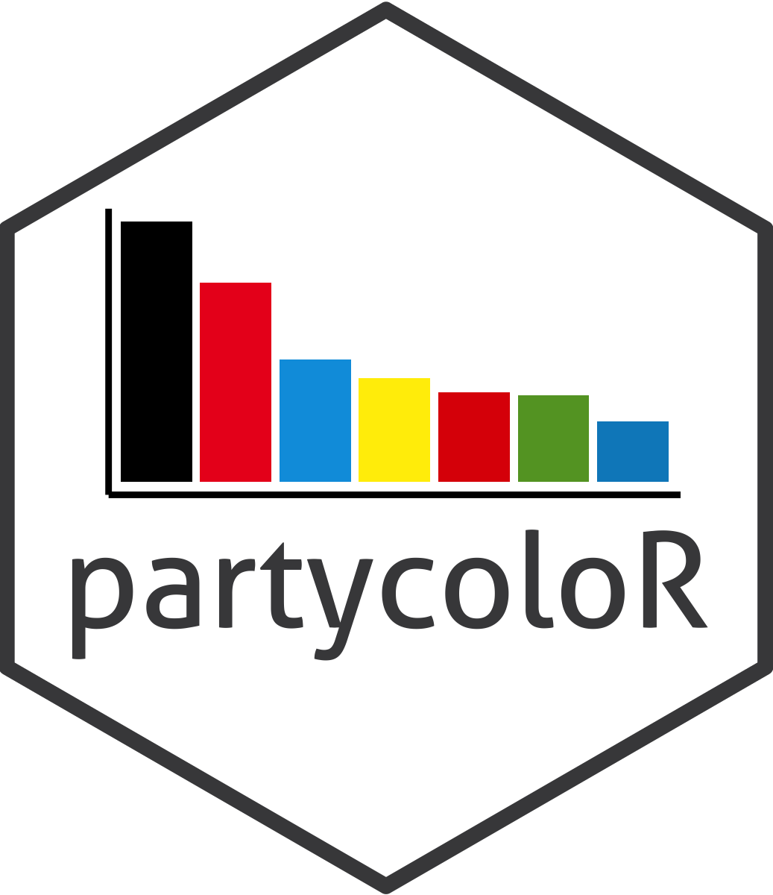

<!-- README.md is generated from README.Rmd. Please edit that file -->


# partycoloR 

<!-- badges: start -->
[](https://CRAN.R-project.org/package=partycoloR)
[](https://github.com/lwarode/partycoloR/actions/workflows/R-CMD-check.yaml)
[](https://lifecycle.r-lib.org/articles/stages.html#experimental)
<!-- badges: end -->

Documentation: <https://lwarode.github.io/partycoloR/>

**partycoloR** extracts political party colors and logos from English Wikipedia
party pages. Party colors play a crucial role in visually identifying political
parties in data visualizations and research.

## Features

- Extract party colors (HEX codes) from Wikipedia infoboxes
- Extract party logo URLs
- Handle parties with multiple colors
- Integrate with the [Party Facts](https://partyfacts.herokuapp.com/) database for party lookups
- Works seamlessly with dplyr/tidyverse workflows

## Installation

You can install partycoloR from [GitHub](https://github.com/lwarode/partycoloR):

```r
# install.packages("devtools")
devtools::install_github("lwarode/partycoloR")
```

## Quick Start

### Extract Party Colors


``` r
library(partycoloR)

# Single party
get_party_color("https://en.wikipedia.org/wiki/Democratic_Party_(United_States)")
#> "#0015BC"

# Multiple parties
urls <- c(
  "https://en.wikipedia.org/wiki/Democratic_Party_(United_States)",
  "https://en.wikipedia.org/wiki/Republican_Party_(United_States)"
)
get_party_color(urls)
#> "#0015BC" "#E81B23"
```

### Extract Party Logos


``` r
get_party_logo("https://en.wikipedia.org/wiki/Democratic_Party_(United_States)")
#> "https://upload.wikimedia.org/wikipedia/commons/thumb/..."

# Download a logo to file
get_party_logo_by_name("SPD", country = "DEU") %>%
  download_party_logo("spd_logo.svg")
```

### Get Both at Once


``` r
get_party_info(urls)
#> # A tibble: 2 x 3
#>   url                                                      color   logo_url
#>   <chr>                                                    <chr>   <chr>
#> 1 https://en.wikipedia.org/wiki/Democratic_Party_(Unite... #0015BC https://...
#> 2 https://en.wikipedia.org/wiki/Republican_Party_(Unite... #E81B23 https://...
```

### Use with dplyr


``` r
library(dplyr)

parties <- tibble(
  party = c("Democrats", "Republicans"),
  wiki_url = urls
)

parties %>%
  mutate(color = get_party_color(wiki_url))
#> # A tibble: 2 x 3
#>   party       wiki_url                                               color
#>   <chr>       <chr>                                                  <chr>
#> 1 Democrats   https://en.wikipedia.org/wiki/Democratic_Party_(Un... #0015BC
#> 2 Republicans https://en.wikipedia.org/wiki/Republican_Party_(Un... #E81B23
```

### Look Up Parties by Name

Don't have Wikipedia URLs? Use the Partyfacts integration:


``` r
# Download Partyfacts data
pf_data <- get_partyfacts_wikipedia()

# Look up a party
lookup_party_url("SPD", country = "DEU")

# Or get the color directly
get_party_color_by_name("SPD", country = "DEU")
#> "#E3000F"
```

## How It Works

The package scrapes the Wikipedia infobox (vcard table) for party pages,
extracting:

- **Colors**: From `<span>` elements with `background-color` style attributes
- **Logos**: From the infobox image cell


## Related Resources

- [Party Facts](https://partyfacts.herokuapp.com/) - Party Facts links datasets on political parties across a wide range of social science datasets
- [ParlGov](http://www.parlgov.org/) - Database on parties, elections and cabinets from EU and OECD democracies
- [ParlGov Dashboard](https://lwarode.shinyapps.io/ParlGov_Dashboard/) - R Shiny dashboard with data from ParlGov and party colors from `partycoloR`


## Citation

If you use this package in your research, please cite it:

```r
citation("partycoloR")
```

## License

GPL-3
